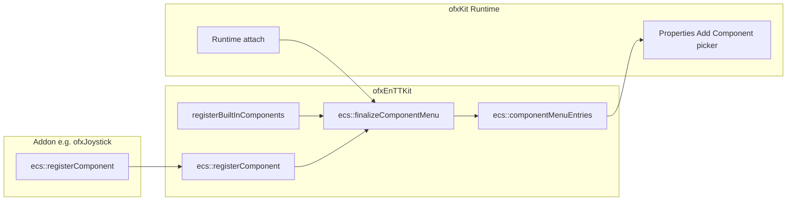

# Component Registry (ofxEnTTKit)

**ofxEnTTKit owns the component picker registry.** This is not EnTT type registration — `registry.emplace<T>(e)` always works without signup. The registry is only for **editor UI**: the **"+ Add Component"** picker and its `has` / `add` / `remove` hooks.

Implementation: [`src/component_editor_registration.h`](../src/component_editor_registration.h) / [`component_editor_registration.cpp`](../src/component_editor_registration.cpp).

UI shells such as **ofxKit** read `ecs::componentMenuEntries()` — they do not register components themselves.

---

## Architecture



---

## API

| Function | Purpose |
| -------- | ------- |
| `ecs::registerComponent<T>(name, category)` | Queue a picker row; `has` / `remove` generated from `T` |
| `ecs::registerComponent<T>(name, category, add)` | Same, with custom `add` lambda |
| `ecs::registerComponentMenuEntry(entry)` | Full-control row (`ComponentMenuEntry`) |
| `ecs::finalizeComponentMenu()` | Build registry once (shipped rows + queued addon rows). Idempotent. |
| `ecs::componentMenuEntries()` | All rows in registration order (calls `finalizeComponentMenu()` if needed) |
| `ecs::componentMenuCategories()` | Unique category names in registration order |

Each `ComponentMenuEntry` carries:

| Field | Purpose |
| ----- | ------- |
| `name` | Display label in the picker |
| `category` | Group header (`"3D"`, `"Input"`, …) |
| `description` | Tooltip (optional) |
| `has` | `bool(registry, entity)` — already attached? |
| `add` | `void(registry, entity)` — attach / initialise |
| `remove` | `void(registry, entity)` — detach |

---

## Template shorthand (recommended for addons)

```cpp
#include "component_editor_registration.h"  // or ofxEnTTKit.h

// minimal — default emplace<T>(entity)
ecs::registerComponent<grbl::MachineStateComponent>(
    "Machine State", "Machines");

// custom add — extra initialisation
ecs::registerComponent<grbl::MachineStateComponent>(
    "Machine State", "Machines",
    [](entt::registry& r, entt::entity e) {
        r.emplace<grbl::MachineStateComponent>(e).connect("/dev/ttyUSB0");
    });
```

Register **before** `ofkitty::Runtime::attach()` when using ofxKit, or rely on static initialisation in your addon (see ofxJoystick). Rows registered after `finalizeComponentMenu()` are appended automatically.

---

## Full-control registration

```cpp
ecs::registerComponentMenuEntry({
    "Machine State",
    "Machines",
    "GRBL controller connection state",
    [](entt::registry& r, entt::entity e) {
        return r.all_of<grbl::MachineStateComponent>(e);
    },
    [](entt::registry& r, entt::entity e) {
        r.emplace<grbl::MachineStateComponent>(e);
    },
    [](entt::registry& r, entt::entity e) {
        r.remove<grbl::MachineStateComponent>(e);
    },
});
```

---

## Kit-init helper pattern

```cpp
// ofxPlotterKit/src/kit/plotter_kit.cpp
void plotter::kit::registerComponents() {
    ecs::registerComponent<grbl::MachineStateComponent>("Machine State", "Machines");
    ecs::registerComponent<grbl::MotionPlannerComponent>("Motion Planner", "Machines");
    ecs::registerComponent<grbl::CoordinateSystemComponent>("WCS", "Machines");
}
```

```cpp
// ofApp.cpp — call before Runtime::attach() if not using static init
void main() {
    plotter::kit::registerComponents();
    ofkitty::Runtime::attach(window, app);
    ofRunApp(window, std::move(app));
}
```

---

## Querying the registry

```cpp
const auto& rows = ecs::componentMenuEntries();
auto cats = ecs::componentMenuCategories();

for (const auto& row : rows) {
    if (row.name == "Mesh" && row.has && !row.has(reg, e))
        row.add(reg, e);
}
```

---

## Input poll hooks (related)

Gamepad backends attach poll hooks separately — they do not use the picker registry:

```cpp
ecs::InputSystem::setJoystickPollHook([](ecs::joystick_input_component& joy) {
    // fill joy.axes, joy.buttonPressed, …
});
```

See **ofxJoystick** (`ofxJoystickKit.h`) for a reference implementation.

---

## Shipped categories

| Category | Examples |
| -------- | -------- |
| Transform | Node, Tag, Selectable, File Path |
| 3D | Mesh, Render, Light, Material, Shader, Trail, Cubemap… |
| 2D | Circle, Rectangle, Bezier, Spline, Text, Sprite… |
| Rendering | Post FX, Canvas FX |
| Media | Image, Video, FBO, FBO Reference |
| Camera | Camera |
| Animation | Tween, Particles |
| Modulation | Modulator, Mod Binding |
| Color | Color Swatches (paints — Solid Color, Gradient, Fill, Stroke — are registered by ofxKit) |
| Hardware | Serial, OSC, Audio Source, MIDI, mmWave, GPIO |
| Input | Keyboard Input (gamepad via addon backends) |
| LED | UV LED Map, UV Sample |
| Music | Transport, Clock, Sequencer, Pattern, MIDI Output, Trigger lanes… |

Property panels for attached components are type-driven via **ofxEnTTInspector** — not this registry.

---

## ofxKit consumer doc

How the ofKitty Runtime attaches and renders the picker: [ofxKit/docs/component-registry.md](../../ofxKit/docs/component-registry.md).
